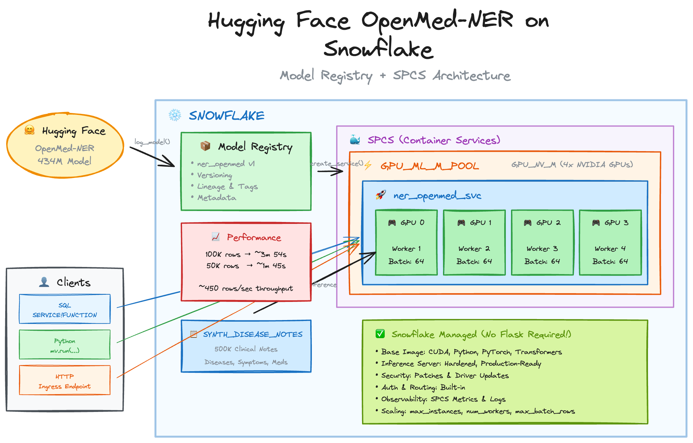
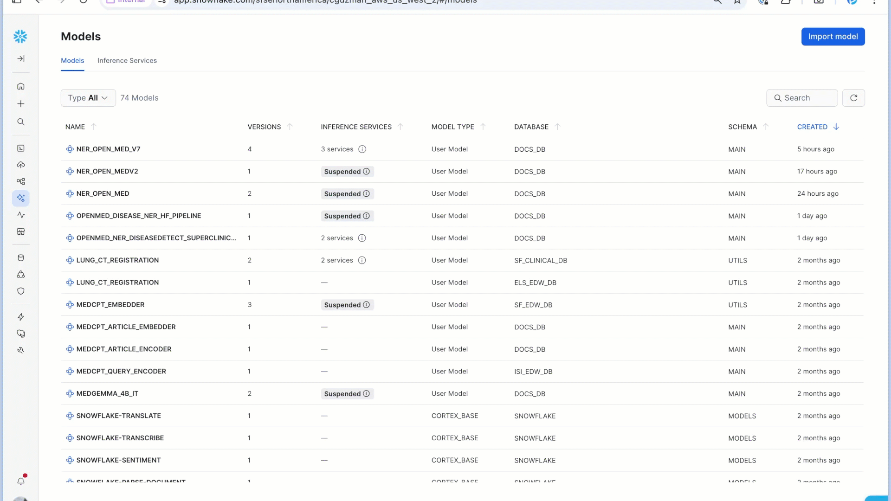
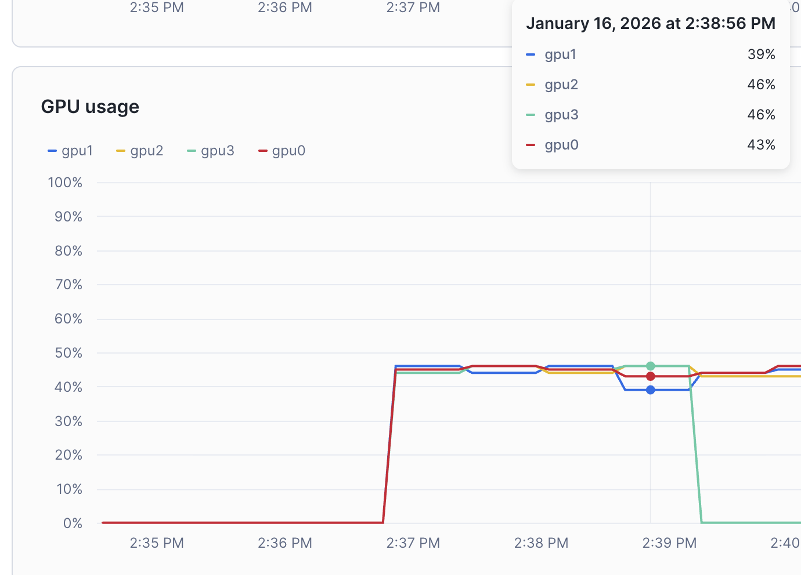

# Hugging Face OpenMed-NER on Snowflake

Deploy the [OpenMed/OpenMed-NER-DiseaseDetect-SuperClinical-434M](https://huggingface.co/OpenMed/OpenMed-NER-DiseaseDetect-SuperClinical-434M) Hugging Face model on Snowflake using **Model Registry + SPCS** — no custom Flask app required.

---

## Overview

This repository demonstrates how to deploy Hugging Face NER pipelines directly through Snowflake's built-in HF support, replacing custom Flask-based inference servers with a **fully managed inference stack**.

### Why This Approach?

| Custom Flask on SPCS | Model Registry + SPCS |
|---------------------|----------------------|
| You own the Docker image, gunicorn config, REST server | Snowflake owns the base image & inference server |
| Manual CUDA driver / PyTorch / transformers upgrades | Security patches & driver updates handled by Snowflake |
| Custom service function & auth logic | First-class SQL, Python, and HTTP interfaces |
| N Flask apps to maintain across models | Single, hardened serving stack for all models |

---

## About OpenMed-NER-DiseaseDetect-SuperClinical-434M

The [OpenMed-NER-DiseaseDetect-SuperClinical-434M](https://huggingface.co/OpenMed/OpenMed-NER-DiseaseDetect-SuperClinical-434M) is a state-of-the-art transformer model specifically fine-tuned for **Named Entity Recognition (NER)** of disease mentions in biomedical and clinical text. It is part of the [OpenMed](https://huggingface.co/OpenMed) collection of 380+ open-source medical AI models released under the Apache 2.0 license.

### What It Does

The model identifies and extracts disease entities from unstructured clinical text, research papers, and healthcare documents. It recognizes:
- `B-DISEASE` — Beginning of a disease entity
- `I-DISEASE` — Inside/continuation of a disease entity

**Example:**
> *"Patient presents with type 2 diabetes mellitus and chronic obstructive pulmonary disease."*

The model extracts: `type 2 diabetes mellitus`, `chronic obstructive pulmonary disease`

### Training & Performance

Trained on the **BC5CDR-Disease corpus** (1,500 PubMed abstracts with 5,818 annotated disease entities), it achieves top-tier performance:

| Metric | Score |
|--------|-------|
| F1 Score | 0.9118 |
| Precision | 0.9028 |
| Recall | 0.9211 |
| Accuracy | 0.9839 |

### Business Problems It Solves

| Use Case | Description |
|----------|-------------|
| **Clinical Decision Support** | Automatically surface relevant diseases from patient notes for clinicians, reducing manual chart review time |
| **Pharmacovigilance & Adverse Event Detection** | Monitor clinical narratives and social media for disease mentions related to drug safety signals |
| **Medical Literature Mining** | Extract disease entities from research papers to build knowledge bases or support systematic reviews |
| **Insurance Claims Processing** | Identify diseases in unstructured claim notes to improve coding accuracy and reduce manual review |
| **Population Health Analytics** | Aggregate disease mentions across patient populations to identify trends, outbreaks, or care gaps |
| **Biomedical Knowledge Graphs** | Populate disease nodes in healthcare ontologies and knowledge graphs for downstream AI applications |
| **Clinical Trial Matching** | Extract disease criteria from eligibility documents and patient records to automate trial matching |

---

## Architecture



---

## Key Benefits

### Fully Managed Inference Stack
Snowflake owns the SPCS base image (CUDA drivers, Python, PyTorch, transformers, etc.) and the inference server. You define the HF pipeline in Python and log it; Snowflake builds the image internally and wires up the service.

### Simpler Ops / Less to Maintain
- No Flask app, no hand-rolled REST server
- No custom Dockerfile or gunicorn config
- No service function to keep patched
- Keep your Terraform/CI/CD focused on declaring models + services, not low-level infra

### First-Class Snowflake Integration



- **Model Registry**: Built-in versioning, lineage, tags, and metadata
- **Safe Rollbacks**: Track which model/version is in prod
- **Multiple Interfaces**: Call from SQL (`SERVICE!FUNCTION`), Python (`mv.run(...)`), or HTTP (ingress endpoint)
- **No Custom Auth**: Snowflake handles authentication and routing

### Optimized Base Images
- Pre-tuned for GPU inference on SPCS
- Correct NVIDIA drivers and CUDA toolchain
- Lean Python environment
- Only extra pip deps are baked in → predictable cold-start and build times

### Scaling & Observability
- Scale horizontally with `max_instances`
- Per-instance concurrency via `num_workers` and `max_batch_rows`
- Metrics and logs surface through standard SPCS monitoring

---

## Performance Benchmarks

Using a `GPU_NV_M` compute pool (4 GPUs) with the following service configuration:

```python
gpu_requests="4"
num_workers=4
max_batch_rows=64
```

| Rows | Time | Throughput |
|------|------|------------|
| 10 | ~1s | Warm-up |
| 50,000 | ~1m 45s | ~476 rows/sec |
| 100,000 | ~3m 54s | ~427 rows/sec |
| 1,000,000 | ~40m 5s | ~416 rows/sec |

All 4 GPUs stay busy throughout inference:



---

## Repository Structure

```
scripts/
├── 1-setup.sql                    # Database, schema, network rules, compute pool
├── 2-generate-synthetic-data.ipynb # Generate 500K synthetic clinical notes
├── 3-log-deploy-model.ipynb       # Log HF pipeline & deploy as SPCS service
└── 4-performance-testing.sql      # SQL queries for benchmarking
```

---

## Quick Start

### Prerequisites
- Snowflake account with SPCS enabled
- `ACCOUNTADMIN` role (for initial setup) and `SYSADMIN` role
- Access to a GPU compute pool (or ability to create one)

### Step 1: Initial Setup

Run `scripts/1-setup.sql` to create:

```sql
-- Grant privileges
USE ROLE ACCOUNTADMIN;
GRANT CREATE INTEGRATION ON ACCOUNT TO ROLE SYSADMIN;
GRANT CREATE COMPUTE POOL ON ACCOUNT TO ROLE SYSADMIN;

-- Create database and schema
USE ROLE SYSADMIN;
CREATE OR ALTER DATABASE DOCS_DB;
CREATE OR ALTER SCHEMA DOCS_DB.MAIN;

-- Create network rule for external access (HF model download)
CREATE NETWORK RULE IF NOT EXISTS ALLOW_ALL_NETWORK_RULES
  MODE = EGRESS 
  TYPE = HOST_PORT
  VALUE_LIST = ('0.0.0.0');

CREATE EXTERNAL ACCESS INTEGRATION IF NOT EXISTS ALLOW_ALL_EAI 
  ALLOWED_NETWORK_RULES = (ALLOW_ALL_NETWORK_RULES)
  ENABLED = TRUE;

-- Create GPU compute pool
CREATE COMPUTE POOL IF NOT EXISTS GPU_ML_M_POOL 
  MIN_NODES = 1
  MAX_NODES = 10
  INSTANCE_FAMILY = 'GPU_NV_M';
```

### Step 2: Generate Synthetic Test Data

Run `scripts/2-generate-synthetic-data.ipynb` in a Snowflake Notebook to create 500K synthetic clinical notes with diseases, symptoms, medications, and visit context.

The synthetic data includes:
- 18 disease types (diabetes, CHF, COPD, cancer, etc.)
- 12 symptom types
- 10 medication types
- Multiple note templates (clinical notes, telehealth calls, PubMed abstracts)

### Step 3: Log & Deploy the Model

Run `scripts/3-log-deploy-model.ipynb` in a Snowflake Notebook:

```python
from snowflake.ml.registry import Registry 
import transformers

# Initialize registry
reg = Registry(session=session, database_name="DOCS_DB", schema_name="MAIN")

# Create the HF pipeline
ner_pipeline = transformers.pipeline(
    task="token-classification",
    model="OpenMed/OpenMed-NER-DiseaseDetect-SuperClinical-434M",
    aggregation_strategy="simple", 
    device_map='auto'
)

# Log to Model Registry
ner_model = reg.log_model(
    ner_pipeline,
    model_name="ner_openmed",
    version_name="v1",
    sample_input_data=input_data,
    pip_requirements=["sentence-transformers", "torch", "transformers"],
    options={"use_gpu": True}
)

# Deploy as SPCS service
ner_model.create_service(
    service_name="ner_openmed_svc",
    service_compute_pool="GPU_ML_M_POOL",
    ingress_enabled=True,
    gpu_requests="4", 
    max_instances=4,
    num_workers=4,
    max_batch_rows=64
)
```

### Step 4: Run Inference

**From SQL:**
```sql
SELECT 
    DOCS_DB.MAIN.NER_OPENMED_SVC!__CALL__(text) AS entities
FROM DOCS_DB.MAIN.SYNTH_DISEASE_NOTES
LIMIT 100;
```


**From Python:**
```python
model = reg.get_model("ner_openmed")
mv = model.version("v1")

df_out = mv.run(
    df[['inputs']],
    function_name="__call__",
    service_name="ner_openmed_svc"
)
```

---

## Service Configuration

| Parameter | Value | Description |
|-----------|-------|-------------|
| `service_compute_pool` | `GPU_ML_M_POOL` | GPU_NV_M instance family (4 GPUs per node) |
| `gpu_requests` | `"4"` | Request all 4 GPUs on the instance |
| `max_instances` | `4` | Horizontal scaling limit |
| `num_workers` | `4` | Concurrent workers per instance |
| `max_batch_rows` | `64` | Batch size for inference |
| `ingress_enabled` | `True` | Enable HTTP endpoint access |

---

## Model Details

- **Model**: [OpenMed/OpenMed-NER-DiseaseDetect-SuperClinical-434M](https://huggingface.co/OpenMed/OpenMed-NER-DiseaseDetect-SuperClinical-434M)
- **Task**: Token Classification (Named Entity Recognition)
- **Parameters**: 434M
- **Specialization**: Disease detection in clinical text
- **Aggregation Strategy**: `simple` (merges B-/I- tags into entities)

---

## Comparison: Flask vs Model Registry

### Before (Custom Flask)
```
┌─────────────────────────────────────────────────────────┐
│  Your Responsibility                                    │
├─────────────────────────────────────────────────────────┤
│  • Dockerfile                                           │
│  • Flask app + REST endpoints                           │
│  • gunicorn / uvicorn config                            │
│  • CUDA driver compatibility                            │
│  • PyTorch / transformers versions                      │
│  • Health checks & error handling                       │
│  • Service function wrapper                             │
│  • Auth / routing logic                                 │
│  • Security patches                                     │
└─────────────────────────────────────────────────────────┘
```

### After (Model Registry + SPCS)
```
┌─────────────────────────────────────────────────────────┐
│  Your Responsibility                                    │
├─────────────────────────────────────────────────────────┤
│  • transformers.pipeline(...) definition                │
│  • reg.log_model(...)                                   │
│  • model.create_service(...)                            │
└─────────────────────────────────────────────────────────┘

┌─────────────────────────────────────────────────────────┐
│  Snowflake Managed                                      │
├─────────────────────────────────────────────────────────┤
│  • Base image (CUDA, Python, PyTorch, transformers)     │
│  • Inference server                                     │
│  • Health checks & error handling                       │
│  • Auth / routing                                       │
│  • Security patches & driver updates                    │
│  • Scaling & observability                              │
└─────────────────────────────────────────────────────────┘
```

---

## Troubleshooting

You can view logs and metrics directly in the **Snowflake UI** (Snowsight) by navigating to **Monitoring → Service & Jobs → Services → ner_openmed_svc**, or use the SQL commands below:

### Check Service Status
```sql
SHOW SERVICES IN COMPUTE POOL GPU_ML_M_POOL;
DESCRIBE SERVICE DOCS_DB.MAIN.NER_OPENMED_SVC;
```

### View Service Logs
```sql
SELECT * FROM TABLE(
    SYSTEM$GET_SERVICE_LOGS('DOCS_DB.MAIN.NER_OPENMED_SVC', 0, 'model-container')
);
```

### Check Compute Pool Status
```sql
DESCRIBE COMPUTE POOL GPU_ML_M_POOL;
```


---

## Resources

- [Snowflake Model Registry Documentation](https://docs.snowflake.com/en/developer-guide/snowflake-ml/model-registry/overview)
- [SPCS GPU Inference Guide](https://docs.snowflake.com/en/developer-guide/snowpark-container-services/overview)
- [Hugging Face Transformers Pipelines](https://huggingface.co/docs/transformers/main_classes/pipelines)
- [OpenMed-NER Model Card](https://huggingface.co/OpenMed/OpenMed-NER-DiseaseDetect-SuperClinical-434M)
